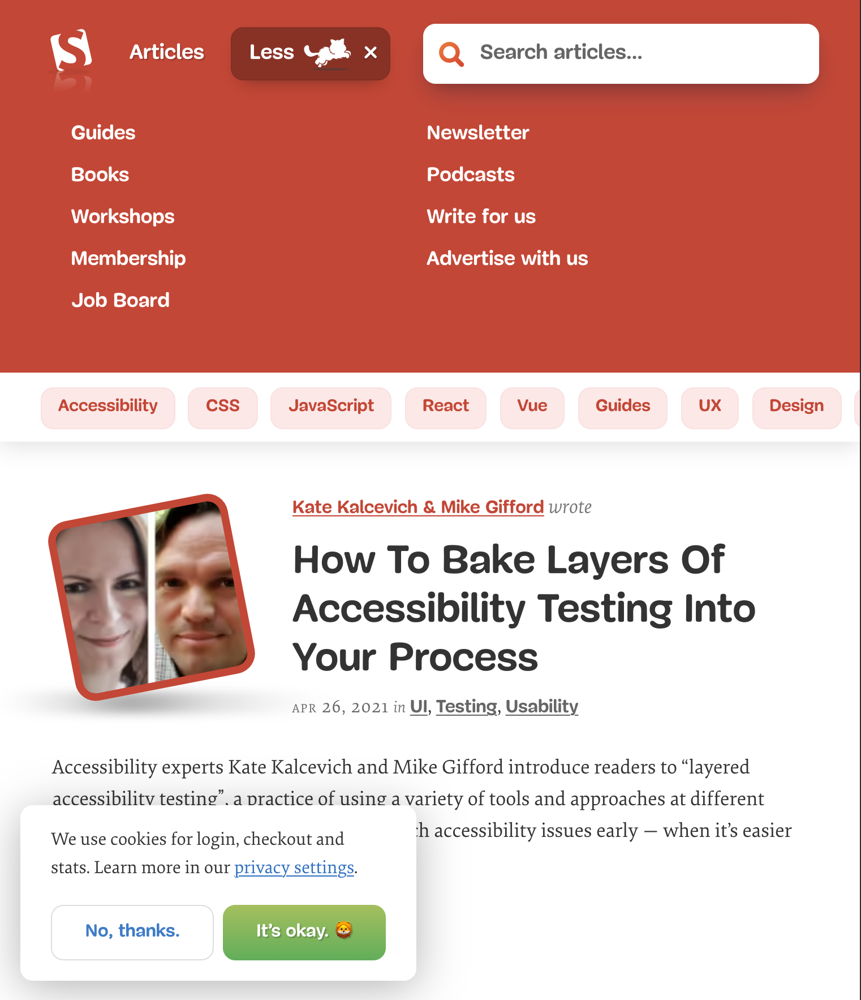
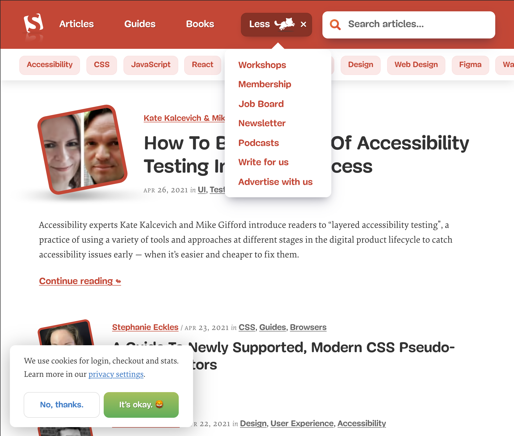

# 반응형 웹 디자인

## 1. 반응형 웹 디자인이란?

### 1.1 정의

### 1.2 필요성

### 1.3 차이점

### 1.4 장단점

## 2. 반응형 웹 디자인의 예

### 2.1 미디어 쿼리(media query)를 잘 활용한 사례

media query를 잘 활용한 사례는 애플의 공식 홈페이지이다. 너비가 746px 이상일 경우에는 새로 나온 iMac의 측면을 보여주어 신제품의 날렵한 옆모습과 다양한 색상이 가능함을 보여주기에 이상적이다. 반면, 너비가 746px 미만일 경우에는 iMac의 정면으로 사진이 회전하여 사용자가 제품을 사용할 때 보이는 모습을 강조하였다. media query를 이용해 자사 제품의 장점을 극대화한 사례로 불 수 있다.

media query를 잘 활용한 두번째 사례는 smashing magazine 홈페이지이다. 해당 예시에서 눈여겨볼 만한 것은 네비게이션 메뉴이다. 너비를 줄이면 메뉴들이 하나씩 줄어들다가 최종 하나 네비게이션만 남게되면 `More`가 `Menu`로 변경되는 것을 볼 수 있다.

`More`의 경우 클릭했을 때 아래와 같은 네비게이션 모드를 확인할 수 있다.
이는 모바일 환경에 최적화를 위해서라고 볼 수 있다.

`Menu`의 경우 클릭했을 때 위와 다른 네이게이션 모드로 변경되었음을 확인할 수 있다. 이는 데스크탑 환경에 익숙한 UX다.

### 2.2 유동 그리드(fluid grid)를 잘 활용한 사례

반응형 이미지를 잘 활용한 사례는 대량의 이미지 사진을 저장하고 이용자들끼리 공유할 수 있는 미국의 핀터레스트를 들 수 있다. 기본 브라우저에서 최대 8단의 사진 그리드에서부터 모바일 화면의 최소 2단까지 1단씩 줄어들며 유동 그리드를 최대로 사용한 예시에 해당한다. 사용자의 디바이스 너비에 따라 최적화된 사진 감상 경험을 극대화하기 위한 사례로 볼 수 있다.

### 2.3 사이즈 조정 가능한 이미지와 텍스트(Resizable image and Text)

사이즈 조정 가능한 이미지와 텍스트를 잘 활용한 사례는 Atlassian 사의 Confluence 소개 페이지다. 해당 제품이 유리한 분야의 예시를 명료히 보여주기 위한 이미지와 텍스트 자료에서 화면 너비에 따라 보기에 편한 사진 이미지의 크기로 계속 변화한다. 특히 눈여겨볼만한 것은 너비가 줄어든다고 해서 사진의 너비가 계속적으로 줄어드는 것이 아니라 줄어들다가 다시 늘어났다는 점이다.

### 2.4 유동 레이아웃 변경(Flexible visuals)

유동적인 레이아웃의 변경으로 모바일과 데스크탑 환경에서 각각 최적의 사용자 경험을 제공하는 사례는 github repository 페이지다. 데스크탑 환경에서는 화면 좌측에 사용자 프로필, 우측에 repository 리스트가 위치해있지만 화면의 너비가 줄어듦에 따라 사용자 프로필은 화면의 윗쪽으로, repository 리스트는 화면의 아랫쪽으로 레이아웃이 유동적으로 변경되었다. 또한 데스크탑 환경에서는 네브바를 포함한 검색 인풋이 모바일 환경에서는 햄버거 메뉴로 숨겨졌다.

## 3. 호환성
