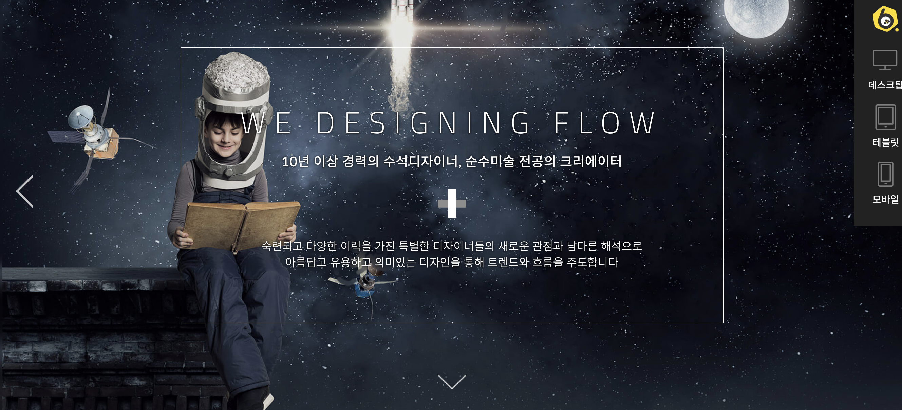
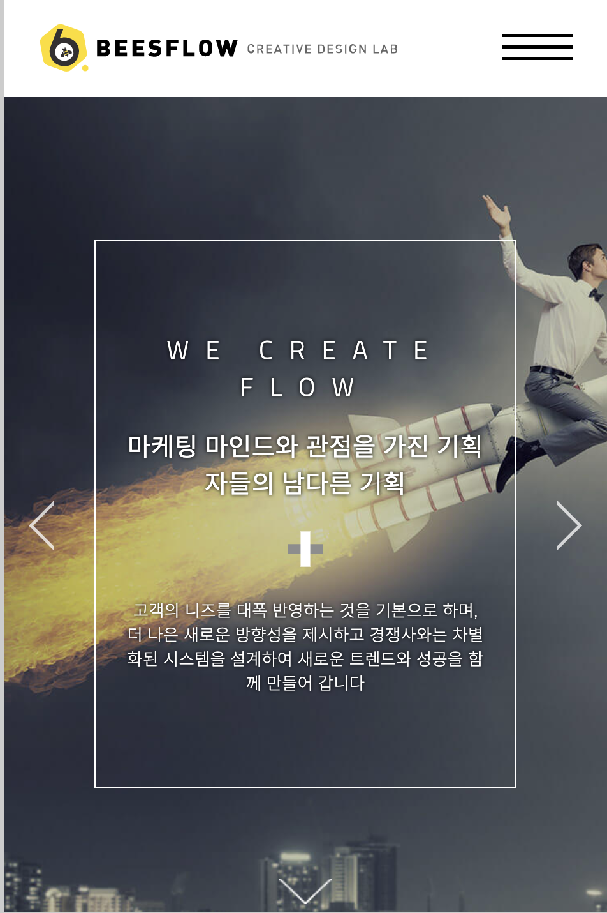
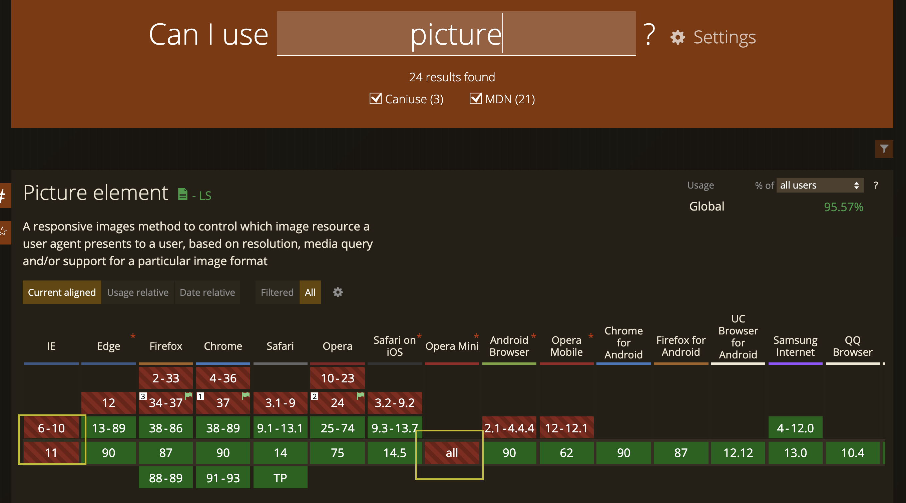
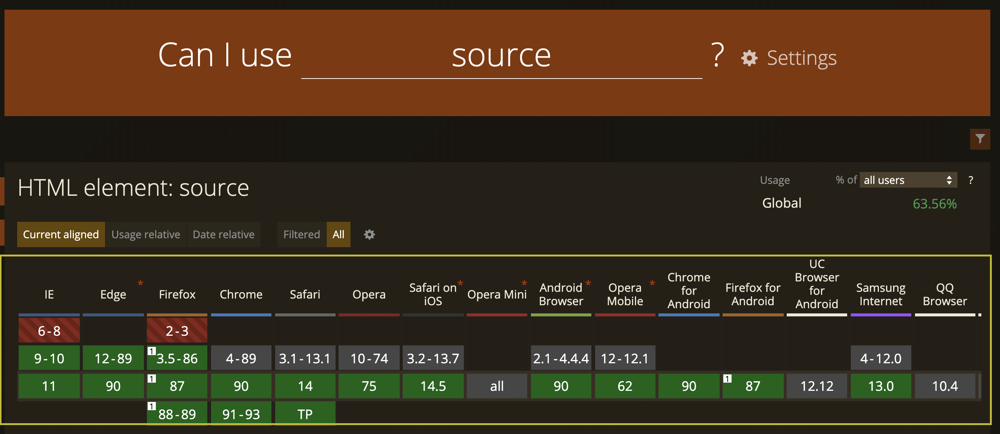
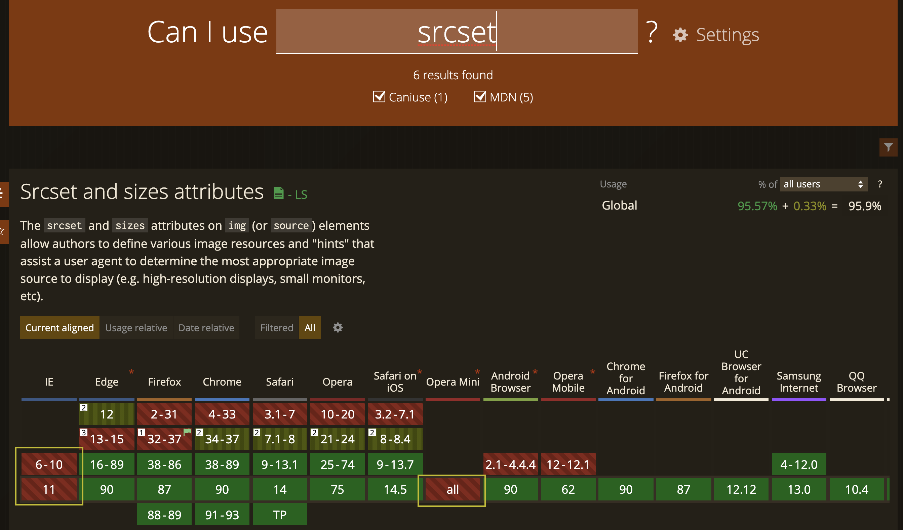

# 반응형 웹 디자인

## 1. 반응형 웹 디자인이란?

### 1.1 정의

반응형 웹 디자인(Responsive Web Design)은 홈페이지 제작, 웹제작과 관련된 기술로 pc, 모바일, 태블릿 등 각각의 기기별로
홈페이지의 페이지를 최적화하여 보여주는 것이다. 화면이 작은 기기에서 반응형 웹으로 제작된 웹사이트를 접속했을 때는 웹사이트의 구조를 작은 화면에 최적화된 구조로 변경하여 보여주고, 큰 화면을 가진 기기에서는 웹사이트의 구조를 큰 화면에 최적화된 구조로
변경하여 보여줄 수 있는데 이처럼 이용자 기기의 화면이나 환경에 맞게 자유자재로 변하는 것이 반응형 웹이다.

즉, 같은 내용을 담은 웹 페이지가 PC, 태블릿, 모바일 등 모든 기기에서 해당 기기에 맞는 해상도와 레이아웃으로 보여지는 것을 의미한다.

#### 1.1.1 간단한 예시

- 데스크탑으로 보여졌을 때

  
  <br/>

- 모바일 화면으로 확인할 때

  

위의 예시에서처럼, 이미지의 사이즈를 view port의 가로 사이즈에 알맞게 조정해서 보여줄 수 도 있고, 필요한 경우 아예 다르 이미지를 보여줄 수도 있다.

1. Resizable Text & Images
2. Media queries
3. Fluid grids
4. Flexible visuals

등에 대한 내용은 뒤에서 예시와 함께 자세히 설명하겠다.

### 1.2 필요성

반응형 웹이 아닌 PC를 기준으로 제작된 고정형 웹 사이트의 경우에는 모바일로 접속시 해상도 문제가 있어 컨텐츠들이 너무 작게보인다거나 PC의 넓은 화면을 모바일의 짧은 화면에서 다 커버하지 못해 컨텐츠를 이용할 때마다 확대해야하는 번거로움이 존재한다. 예를 들어서 로고밖에 보이지 않는 웹 사이트 혹은 장바구니 버튼을 찾기위해서 확대해서 스크롤하며 일일이 찾아봐야하는 웹 사이트가 있다면 사용자들의 이탈률이 높아지고 구매율도, 재방문율도 낮아질 것이다.

하지만 반응형 웹이 등장하면서 웹사이트를 이용하는 사람들에게 모든 기기에서 최적화된 웹사이트를 제공할 수 있게 되었고, PC 버전의 웹사이트와 모바일 버전의 웹사이트 두 가지 모두를 만들지 않아도 됨에 따라 비용과 시간 그리고 인력을 줄일 수 있게 되었다.

또한 스마트폰이나 태블릿이 대중화 되기 이전에는 데스크톱 화면에만 홈페이지를 최적화 시켰지만 요즘 시대에는 모바일웹 접속률이
많이 늘어났고, 더 늘어나고 있기 때문에 지금은 모바일 버전 또한 신경써주어야 하기 때문에 반응형 웹의 필요성이 대두되었다.

### 1.3 고정형 디자인과의 차이점

고정형 웹 디자인은 사용자가 사용하는 기기의 종류, 크기와 상관없이 항상 일정한 크기의 컨텐츠, 일정하게 동작하는 애니메이션 등 가변적이지 않은 디작인을 의미한다. px 단위로 설정된 네이게이션 바, 버튼 그리고 고정된 레이아웃 등은 전형적인 고정형 웹 사이트의 예시이다. 모바일 기기들이 보급화 되기 전, 대부분의 사용자는 PC로 웹 서핑을 하고 서비스를 이용했지만 현재 대부분의 사용자가 모바일 기기를 소유하고 있으며 거의 모든 업무나 서핑 등을 모바일로 처리하고 있기 때문에 위에서 설명한 고정형 디자인은 변화가 필요했다.

그래서 나오게 된 것이 반응형 디자인이다. 반응형 디자인은 고정형 디자인과는 전혀 다르게 사용자들이 사용중인 기기의 사이즈별로 알맞는 텍스트 크기, 이미지 크기, 레이아웃 등을 가변적으로 적용해 사용자의 경험을 최적화한다. 예를 들어서 이미지 사이즈가 휴대폰의 가로 사이즈보다 큰 경우, 이미지 사이즈를 휴대폰의 가로 사이즈에 맞게 줄이고, 네이게이션 바가 가로로 너무 길어 화면을 벗어나는 경우 메뉴들을 collapse 시켜 좌우가 아닌 상하로 안내해주는 등의 기법을 사용한다.

### 1.4 반응형 웹 디자인의 장단점

반응형 웹 디자인의 장점은 기본적으로 좋은 사용자 경험이라고 할 수 있다. 사용자의 기기별로 최적화된 UX를 선사하기 때문이다. 또 다른 장점들은 아래와 같다.

#### 장점 1. 유지보수

만약 모바일 버전의 웹 사이트 UI까지 고려해야하는 경우, 모바일 버전과 테스크톱 버전같이 두 개의 웹사이트를 만들게 되면 웹사이트에 새로운 내용이 추가되거나 수정이 필요할 때 개별적으로 추가 및 수정이 필요할 것이다. 그렇게 되면 비용과 시간이 추가적으로 필요하지만 반응형 웹은 모바일, 태블릿, 데스크톱 등 모든 디자인을 하나의 HTML 파일과 CSS 파일에서 작업하기 때문에 유지 보수가 훨씬 쉽고 간편하다.

#### 장점 2. 마케팅

쉽게 접근할 수 있는 점과 다양한 활동을 자유롭게 펼칠 수 있다는 점 때문에 마케팅 활동 중 최적의 활동은 웹이라고 할 수 있다. 하지만 웹사이트를 데스크톱 버전으로만 만들면 스마트 기기 시대인 지금 작은 화면의 스마트 기기에서는 화면이 작게 보이게 되어 전달하고자 하는 정보들이 제대로 전달되지 않을 것이다. 이때 반응형 웹이라는 기술을 이용하여 웹사이트를 개발하면 환경이나 기기에 따라 최적화된 구조로 웹사이트를 변경하여 보여줄 수 있기 때문에 언제, 어디서, 어떻게든 접근이 용이해야 하는 중요한 웹 마케팅에서 가장 효과적인 방법이 바로 반응형인 것이다.


예를 들어 위와 같은 사이트를 모바일로 보았을 때, 확실히 세로로 정렬이 깔끔히 되어있어 어떤 사이트인지, 확실히 한 눈에 볼 수 있다.

#### 장점 3. 검색엔진 최적화

자신의 웹 사이트를 많이 알리고 싶다면, 검색시 노출을 최대화시켜야 한다. 이것이 바로 검색 엔진 최적화 작업이라고 하는 것인데, 검색 엔진 최적화 SEO(Search Engine Optimize) 작업은 포털사이트 또는 검색 사이트에서 사용자가 특정 키워드로 검색을 했을 때 나오는 웹사이트 검색 결과에서 상위권에 나타나도록 하는 관리 작업을 말한다. 예를 들면 모바일 버전과 데스크톱 버전 두 개의 사이트를 가지고 있는 서비스의 경우 "m.서비스.com", 그리고 "서비스.com" 두 개의 웹 주소가 있을 것이다. 하지만 반응형 웹으로 만들어진 회사의 경우 하나의 주소와 하나의 파일로만 이루어져 하나의 웹 주소만을 갖고 있기 때문에 검색엔진에서는 반응형 홈페이지는 하나의 주소로 검색 결과에 좀 더 노출이 잘 될 수 있고, 주소가 하나이기 때문에 광고 비용도 두 배로 들지 않아 효율적이라고 할 수 있다.

#### 장점 4. 미래 지향적 기술

휘어지는 스마트 TV, 냉장고는 현실화 되어가화 있고 이에 발맞춰 웹 사이트도 발전해야 한다. 만약 이러한 화면에서 광고를 해야할 때, 화면 크기에 따라 광고되고 있는 상품들의 이미지 크기를 변화시켜야 할 것이다. 반응형 웹으로 개발된 웹사이트라면 구조를 환경에 따라 최적화되도록 바뀌어서 보일 것입니다. 하지만 고정형 웹 사이트라면 많은 어려움과 불이익이 있을 것이다. 지금처럼 다양한 기기가 출시되고 앞으로 어떤 크기의 기기가 나올지 모르는 상황에서 반응형 웹은 웹 기술 중 가장 미래 지향적이고, 미래를 준비하는 바람직한 대안이라고 말할 수 있다.

---

#### 딘잠 1. 개발 비용

고정형 웹 디자인만을 고려해 웹 사이트를 개발하는 것에 비해서 반응형 웹 디자인을 고려하려면 더 많은 노력과 디테일을 필요로 하기 때문에 개발자들에게 추가적인 비용을 부과한다. 하지만 이러한 단점도 웹 사이트를 데스크탑과 모바일 각각 개발하는 것 보다는 비용이 적게 들기 때문에 만약 모바일 디자인이 필수적인 경우라면 이는 단점이 아니게 될 것이다.

#### 단점 2. 호환성

일부 반응형을 위한 속성(ex. img 태그의 srcset)들은 브라우저 호환이 되지 않는 등 호환성 문제가 발생해 오히려 사용자의 경험을 해칠 수 있다. 따라서 반응형 웹 디작인을 적용하고자 한다면 브라우저간의 호환성, 환경에 따른 호환성 등을 잘 체크해야 할 것이다.

## 2. 반응형 웹 디자인의 예

## 3. 호환성

### 3.1 호환성이란

웹 호환성이란, 여러 브라우저에서 동일한 사용자 경험을 제공하는 것을 말한다. 21세기는 PC와 모바일 기기를 통들어 사용자가 다양한 기기로 웹 서비스를 이용하기 때문에 호환성을 준수하는 것이 매우 중요해졌다.

### 3.반응형 구현 기술

#### 3.2.1 viewport

`viewport`: 기기 별로 뷰포트가 다르기 때문에 발생하는 배율 문제에 대응하기 위해 meta 태그의 속성으로 뷰포트 관련 설정을 추가할 수 있다.

```html
<meta name="viewport" content="width=device-width, initial-scale=1">
```

위 태그는 뷰포트의 너비를 단말기 너비에 맞추고, 그 배율을 1로 설정한다는 의미가 된다.

#### 3.2.2 picture & source tag

여러 개의 이미지 중에서 가장 적합한 이미지를 선택해 디스플레이나 기기에 표시한다.

#### 1. 문법
```html
<picture>
   <source ....>
   <source ....>
   
</picture>
```
`picture`요소를 사용하려면 위 예시 처럼 자식 요소로 0개 이상의 `source`요소와 적어도 하나 이상의 `img`요소를 지정해 주어야한다. `picture` 요소를 지원하는 브라우저는 `source` 요소중에 가장 적합한 이미지를 선택해 디스플레이나 기기에 표시한다. 만약, `source` 요소중에 적합한 이미지를 찾을 수 없거나, `picture` 태그를 지원하지 않는 경우에는 `img` 요소를 표시한다.
#### 2. 활용
- 로딩시간을 줄인다.
- 

`source tag`: picture, audio, video 태그 내부에서 사용하는 요소이다. source 태그는 미디어 자료가 저장된 위치를 가리키며, 여러 미디어 자료 중 사용자에게 가장 적합한 데이터를 전달하기 위해 사용한다.

```html
<picture>
    <source srcset="/media/cc0-images/surfer-240-200.jpg"
            media="(min-width: 800px)">
    
</picture>
```

위에서 설명한 picture 태그와 source태그는 아래 CanIUse 사이트에서 조회한 결과, IE와 Opera 브라우저와 호환되지 않는다.


<br/>


#### 3.2.3 img tag attributes

`srcset`: 이미지 소스의 세트를 설정할 수 있다. 이 속성을 사용하면 브라우저가 사용자의 환경에 맞춰  가장 적합한 이미지를 선택해 보여준다.

`sizes`: 미디어조건을 설정하고, 설정한 미디어 조건에 해당하는 최적화 출력 크기를 지정한다.

```html

```

caniuse 에서 제공하는 정보에 의하면 picture 태그는 IE와 Opera Mini 브라우저에서 사용할 수 없다.



#### 3.2.4 media-query

미디어 쿼리는 미디어 유형과, 미디어의 특성에 따라 스타일을 지정하고 싶을 때 사용한다.

#### 1. 문법

```
@media 조건 {
    css 문법
}
```

> 참고1
> 조건에는 미디어의 유형 또는 특성을 입력한다.

> 참고2
> 조건을 충족하면 {} 내에 작성한 css 문법이 적용된다.
#### 1.1 논리 연산자

`not`, `and`, `or`, `only`와 같은 논리 연산자를 사용해서 쿼리를 조합하면 복잡한 조건식을 만들 수 있다.

#### a and b:

`and` 연산자를 사용하면 조건 `a`와 `b`를 모두 충족해야 스타일이 적용된다.

#### a or b:

`or`을 사용하면 다수의 기능을 판별해서 하나라도 맞는 경우 스타일을 적용시킬 수 있습니다.

#### not a and b

`not` 연산자를 사용하면 이따라 작성된 전체 조건식의 의미를 반전시킨다. 즉 a 조건에만 적용되는 것이 아니고 a and b에 적용된다.

> @media not all and (monochrome) {...}
> 위의 쿼리는 아래와 같이 평가된다.
> @media not(all and (monochrome)) {...}
> 아래와 같이 평가되는 것이 아니다.
> @media (not all) and (monochrome) {...}

#### only

`only` 연산자는 전체 쿼리가 일치할 경우에만 스타일이 적용된다.

`screen and (max-width: 500px)` 쿼리를 작성했을 때 구형 브라우저에서 `max-width:500px` 부분을 인식하지 못하기 대문에 screen 조건이 참이되면 스타일을 적용해 버린다. 이와 같은 오류를 방지하기 위해 `only`를 사용할 수 있다.

### 참고자료

- https://developer.mozilla.org/en-US/docs/Web/HTML/Viewport_meta_tag
- https://developer.mozilla.org/en-US/docs/Web/HTML/Element/picture
- https://developer.mozilla.org/en-US/docs/Web/HTML/Element/source
- https://developer.mozilla.org/en-US/docs/Web/HTML/Element/picture
- https://developer.mozilla.org/ko/docs/Web/CSS/Media_Queries/Using_media_queries

